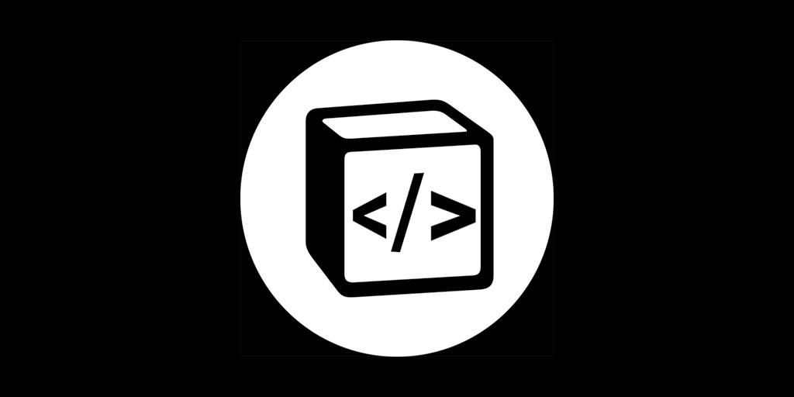

# Notion Page To HTML

NodeJS tool to convert public notion pages to HTML.

## Supported features

Most of native Notion blocks are currently supported:

- Headings
- Text With Decorations
- Quote
- Image
- YouTube Videos
- Code
- Math Equations
- To-do
- Checkbox
- Bulleted Lists
- Numbered Lists
- Toggle Lists
- Divider
- Callout
- Nested blocks

Embeds and tables are not supported yet.

## Why notion-page-to-html?

It's perfect as content manager system

- This tool can get any public page from Notion and convert it to html. This is perfect
  for the ones who want to use Notion as CMS. Once it gets page content from Notion, it becomes completely independent (images are converted to base64 so you do not have to call Notion again to get content). You can convert a page and then make it private again.

It's fully customizable

- You can choose how you want to get page content. Do you want title, cover, and icon in html body? You can do that! Do you want they apart of html so you can choose where place it? You have it. Do want html without style? Without Equation and Code Highlighting scripts? Do you want body content only? You have those options too.

## Basic Usage

Install it using npm

```bash
npm install notion-page-to-html
```

Then, just import it and paste a public Notion page url

```jsx
const NotionPageToHtml = require('notion-page-to-html');

// ...
const page = NotionPageToHtml.convert(
  'https://www.notion.so/asnunes/Simple-Page-Text-4d64bbc0634d4758befa85c5a3a6c22f',
);

const { title, cover, icon, html } = NotionPageToHtml.convert(
  'https://www.notion.so/asnunes/Simple-Page-Text-4d64bbc0634d4758befa85c5a3a6c22f',
);
```

`cover` is a base64 string from original page cover image. `icon` can be an emoji or base64 image based on original page icon. `html` is a full html document by default. It has style, body, MathJax and PrismJS CDN scripts by default. You can pass some options to handle html content.

```jsx
const page = NotionPageToHtml.convert(
  'https://www.notion.so/asnunes/Simple-Page-Text-4d64bbc0634d4758befa85c5a3a6c22f',
  options,
);
```

`options` is an object with the following keys

| Key                     | Default value | If true                                                |
| ----------------------- | ------------- | ------------------------------------------------------ |
| `excludeCSS`            | false         | returns html without style tag                         |
| `excludeMetadata`       | false         | returns html without metatags                          |
| `excludeScripts`        | false         | returns html without script tags                       |
| `excludeHeaderFromBody` | false         | returns html without title, cover and icon inside body |
| `excludeTitleFromHead`  | false         | returns html without title tag in head                 |
| `bodyContentOnly`       | false         | returns html body tag content only                     |

---

## Contributing

We love your feedback! Feel free to:

- Report a bug
- Discuss the current state of the code
- Submit a fix
- Propose new features
- Become a maintainer

Just create a Github issue ;)
